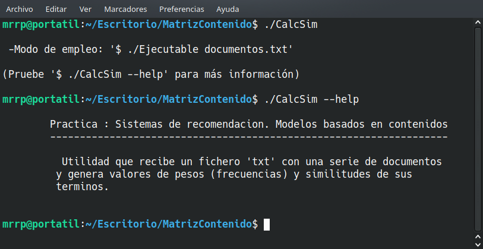
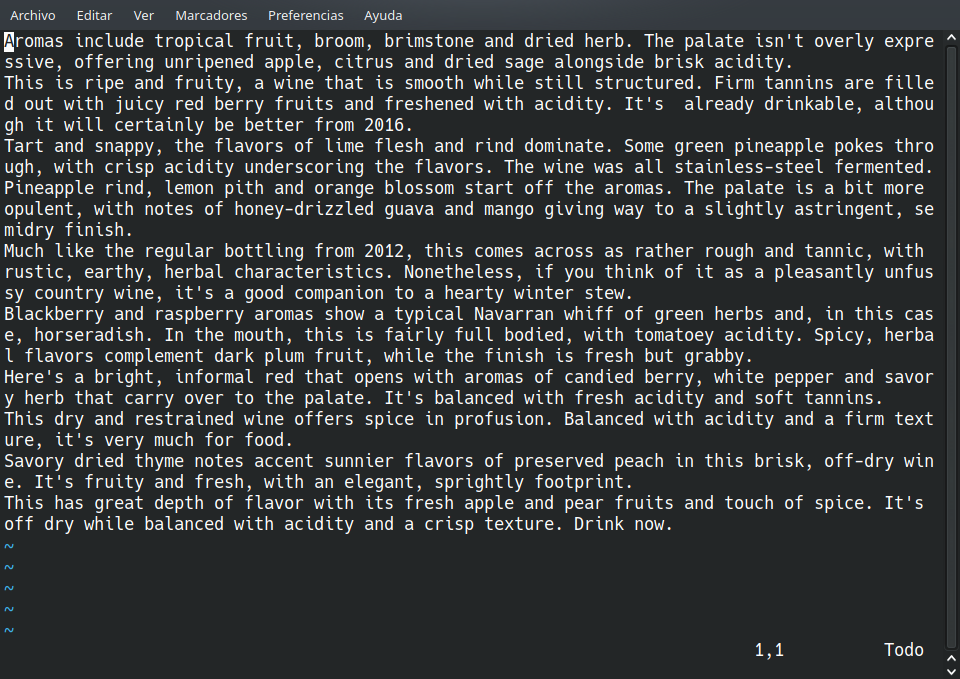
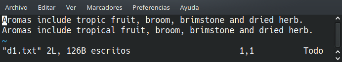
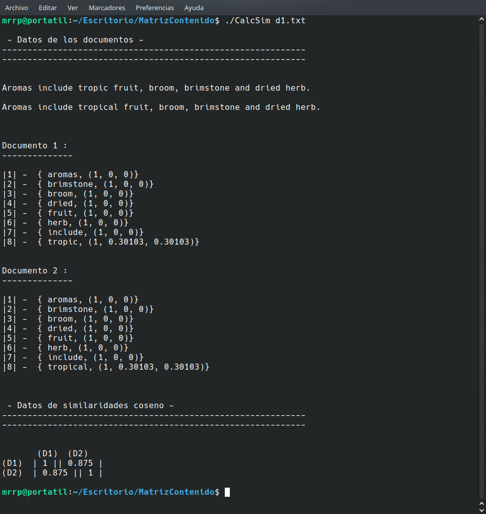
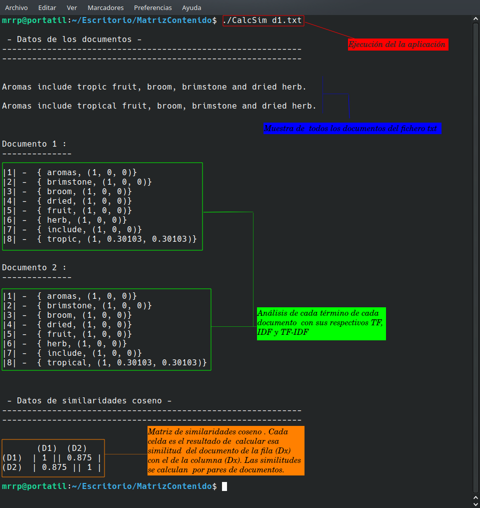

# Gestión del Conocimiento en Organizaciones.

##  Práctica - Sistemas de recomendación. Modelos basados en el contenido.

--------------------------------------------------------------------------

* Autor : Manuel Ramón Regalado Peraza
* email : alu0100283433@ull.edu.es

### Introducción.

La intención de la práctica es aprender, usando modelos basados en contenido,
en como tratar una serie de contenidos independientes entre sí (normalmente
artículos o documentos como es en este caso) para lograr, cuantificar analizando
sus términos o palabras, lo similares que son entre ellos en contenido (pares del
documentos).

Usaremos para cuantificar la similitud de pares de documentos la medida
'similaridad coseno', cuyos valores oscilan en el rango de 0 a 1 : Cuanto más
cercano a 1 sea la similaridad entre pares de documentos más parecidos serán
entre ellos, y cuanto más cercano a 0 sea la similaridad menos parecidos serán.

Un caso de uso es cuando se necesita recomendar obras con contenido similar a
los que han visto, leido, etc. otros usuarios a un usuario que todavía no ha
consumido esos contenidos.


### Descripción del código desarrollado.

  - El lenguaje usado para el programa es C++, por ser el que más experiencia
se tiene. La estructura del código es la siguiente :

    * Un fichero _main.cc_, el cual recibe como argumento el fichero _.txt_ con
  los documentos a analizar. Lo carga en un objeto de la clase _**Matriz**_, el
  cual extrae todas las palabras de cada documento, las limpia (quita signos de
  puntuación, espacios, mayúsculas, _stopwords_, etc.) y las guarda en una
  estructura tipo `std::map` con cada palabra y las frecuencias TF, IDF, TF-IDF.
    Justo a continuación usa los datos del objeto _**Matriz**_ anterior para
  pasarlo a un objeto de clase _**SimilitudCoseno**_ el cual generará una tabla
  con todas las similitudes de pares de todos los documentos extraídos

    * Un fichero _**main.cc**_, el cual recibe como argumento el fichero _.txt_ con
  los documentos a analizar. Lo carga en un objeto de la clase _**Matriz**_, que
  guarda para cada documento cada palabra usada, su _TF_, su _IDF_ y su _TF-IDF_.
  A continuación usa un objeto de la clase _**SimilitudCoseno**_ para calcular
  las similitudes de pares de documentos de todos los documentos que se encontraban
  en el fichero.

    ```C++
      int main (int argc, char* argv[]) {
        // ...
        } else if (argc == 2) {
        // ...
          // Generación de la matriz con datos de recomendación.
          Matriz matriz(argv[1]);
    
          // ...
    
          // Generación de la matriz con los datos de la similitud coseno.
          SimilitudCoseno sm(matriz.getMapa());
    
        // ...
      }
    ```
    * Un par de ficheros _**gestor_ficheros.cc**_/_**gestor_ficheros.h**_.
  Proveen funcionalidad para abrir el fichero _.txt_ con los documentos, leer
  el contenido y extraerlo línea a línea usando la clase _**GestorFicheros**_. 

    ```C++
      // Fichero gestor_ficheros.h

      // Atributo en la clase GestorFichero
      std::ifstream flectura_ // Flujo del fichero abierto en modo lectura.
      }
    ```

    ```C++
      // Fichero gestor_ficheros.cc

      // Lee una linea del fichero cada vez. Devuelve un false cuando ha llegado al
      // final del fichero.
      //------------------------------------------------------------------------------
      bool GestorFicheros::LeerLinea(std::string& guarda_linea) {
        std::getline(flectura_, guarda_linea);
      
        if (flectura_) { 
          return true;
        }
      
        flectura_.close();
        return false;
      }
    ```

    * Un par de ficheros _**matriz.cc**_/_**matriz.h**_, que se encargan de 
  los documentos a analizar. Todos los datos de los documentos se almacenan
  en una estructura tipo ```std::vector```, siendo cada elemento un 
  ```std::map<std::string, std::tuple<int, double, double>```, donde se
  guardan todas las palabras y sus frecuencias _TF/IDF/TF-IDF_ de cada documento.
  Las funcionalidades de esta clase incluyen : Extraer cada documento del _.txt_
  en un vector de string, operaciones de limpieza sobre las palabras de ese vector
  (eliminación de signos de puntuación, espacios, letras mayúsculas y stopwords),
  contabilización del número de palabras repetidas (**TF**) y cálculo de las
  frecuencias-pesos **IDF** y **TF-IDF**.

    ```C++
      // Fichero matriz.h

      // ...
      
      // Alias.
      using vectorString_t = std::vector<std::string>;
      using tupla_t = std::tuple<int, double, double>;
      using mapa_t = std::map<std::string, tupla_t>;

      class Matriz {
       private:
      
        // Gestiona la lectura del .txt
        GestorFicheros* m_gestor_ficheros;  
      
        std::vector<std::string> m_stopWords = {"a","an","and","with","this","these",
        "those","that","as","of","the","to","from","in","if"};
      
        std::vector<mapa_t> m_mapa;
      
        //  Hace la carga de los documentos en el fichero, procesa los datos y los
        // guarda en m_matriz.
        void CargarFicheroEnMatriz();
      
        // Extrae las palabras del documento una a una en el orden de aparición.
        vectorString_t ExtraerPalabrasDocumento(std::string linea);
      
        // Elimina símbolos de puntuación finales de las palabras.
        vectorString_t EliminarPuntFin(vectorString_t listaPalabras);
      
        vectorString_t EliminarEspaciosFinales(vectorString_t listaPalabras);
      
        // Todas las palabras de la lista a minúsculas.
        vectorString_t PasarAMinusculas(vectorString_t listaPalabras);
      
        vectorString_t EliminarStopWords(vectorString_t listaPalabras);
      
        mapa_t ContarPalabrasDocumento(vectorString_t words);
      
        // Cálculo del IDF y el TF-IDF tras obtener el TF.
        void CalcularFrecuencias();
      
        void MostrarMatrizDocumentos();
       public:
        // El constructor se encargará de abrir el fichero de lectura
        Matriz(char* entrada);
        ~Matriz() { delete m_gestor_ficheros; } 
      
        std::vector<mapa_t> getMapa() {return m_mapa;}
      };

    ```

    * Un par de ficheros _**sim_coseno.cc**_/_**sim_coseno.h**_. Calculan la
  similaridad coseno entre todas las combinaciones de pares de documentos
  que aparecen en el fichero _.txt_. Usa los datos generados y guardados en
  un objeto de la clase _**Matriz**_ (cada palabra y su _TF_ de cada documento)
  para hacer todos los cálculos necesarios para hallar ese valor de similitud
  de pares.

    ```C++
      using matrizDouble_t = std::vector<std::vector<double>>;
      
      using mapaLookup_t = std::map<std::string, double>;
      using vMapaLookup_t = std::vector<mapaLookup_t>;
      
      class SimilitudCoseno {
        private:
          // Donde guardaremos los valores intermedios
          vMapaLookup_t m_lookupTable;
      
          //  En esta matriz/tabla de 'n x n' se guardarán en cada celda las
          // similitudes entre documentos/artículos.
          matrizDouble_t m_tablaSimilitudes;
      
          //  Copia los datos del mapa con los documentos, pero sólo las palabras
          // y el TF, el resto (IDF, TF-IDF) se descarta. Se vuelva entonces en
          // 'm_lookupTable'.
          void VolcarMatrizLookup(std::vector<mapa_t> documentosTabla);
      
          //  Normaliza los valores de los TF de cada término de cada documento
          // según la fórmula '1 + log(TF)' que aparece en la página 130 de los
          // apuntes. Los valores a normalizar están en 'm_lookupTable'
          void NormalizarTF();
      
          // Calculamos el vector normalizado de cada término a partir de cada
          // TF normalizado de un documento de 'm_lookupTable'. Los resultados
          // nuevos se sustituyen por los anteriores en 'm_lookupTable'
          void NormalizarTerminos();
      
          //  Rellena la tabla/matriz 'm_tablaSimilitudes' con los cálculos de la
          // similaridad entre los documentos mediante el coseno. Siendo la
          // matriz regular 'n x n' en el que la celda (i,j) contiene la similitud
          // entre el documento i (fila) y el documento j (columna). La filas y las
          // columnas representan los mismos documentos en el mismo orden.
          void CalcularSimCoseno();
      
          void MostrarLookup();
      
          //  Muestra todas las similitudes entre pares de documentos en "formato
          // tabla.
          void MostrarTablaSimilitudes();
        public:
          SimilitudCoseno(std::vector<mapa_t> documentosTabla);
      };
    ```
### Ejemplo de uso.

* Tenemos una descripción del modo de uso de la aplicación si escribimos
**$./CalcSim** en la terminal.



_<p style="text-align: center;">Uso del ejecutable</p>_

* Para funcionar, además habrá que proveer al ejecutable de un fichero _txt_
con los documentos a analizar. La estructura de estos está conformada por
palabras separadas por espacios y un salto de línea indica que lo que
hay a continuación se trata del documento siguiente al actual.



_<p style="text-align: center;">Sintaxis de los documentos usados en los txt</p>_

  * Así, si queremos analizar el fichero de ejemplo `d1.txt`, que son sólo dos
documentos exáctamente iguales salvo en una palabra (tropic / tropical) :



  * Escribiremos en la terminal `./CalcSim d1.txt` y el resultado será el que se ve
a continuación :



  * Que con una explicación con más detalle tenemos : 


